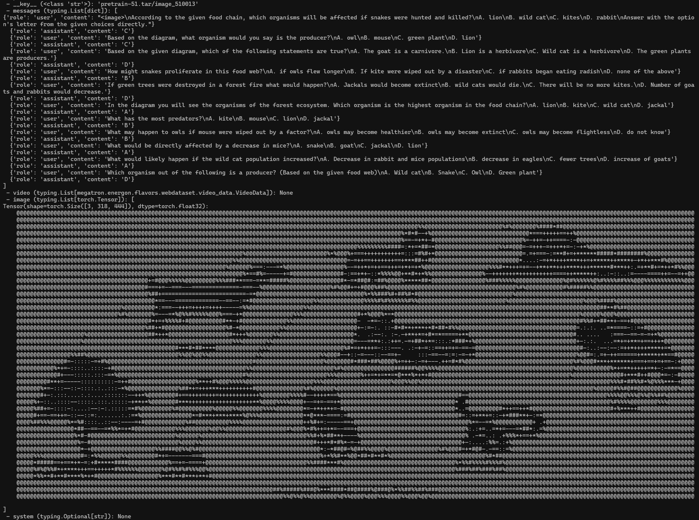

# Preprocesamiento de datos SFT

### 1.🐳 Docker (recomendado)

Recomendamos encarecidamente usar el entorno Docker para una experiencia perfecta.
```bash
# Clonar el repositorio
git clone https://github.com/EvolvingLMMs-Lab/mini-retro-OneVision-1.5.git
cd mini-retro-OneVision-1.5

docker build -t mini_retro_megatron:25.04 .

# Ejecuta el contenedor con -w para fijar el directorio de trabajo en el volumen montado
docker run -it --gpus all \
    --ipc host --net host --privileged --cap-add IPC_LOCK \
    --ulimit memlock=-1 --ulimit stack=67108864 --rm \
    -v $(pwd):/workspace/mini-retro-OneVision-1.5 \
    -w /workspace/mini-retro-OneVision-1.5 \
    --name "mini_retro_megatron_container" \
    mini_retro_megatron:25.04 /bin/bash
```
## 2 \. Descarga de datos

Descargue mini-retro-NeXT-780k en [🤗HF/mini-retro-NeXT-780k] (https://huggingface.co/datasets/lmms-lab/mini-retro-NeXT-data)

## 3 \. Ejecutar la conversión de WebDataset

### 3.1. Procesamiento de datos sin procesar
Aquí proporcionamos la guía del código para convertir el conjunto de datos en el formato de mini-retro-OneVision.
```python
import os
import json
import pandas as pd
from PIL import Image
from io import BytesIO
from tqdm import tqdm

PARQUET_DIR = "mini-retro-NeXT-Data/data"
OUTPUT_IMAGE_DIR = "images"
OUTPUT_JSON_FILE = "mllm_mix.json"

os.makedirs(OUTPUT_IMAGE_DIR, exist_ok=True)
merged_data = []

for filename in tqdm(sorted(f for f in os.listdir(PARQUET_DIR) if f.endswith('.parquet'))):
    df = pd.read_parquet(os.path.join(PARQUET_DIR, filename), columns=['id', 'conversations', 'image'])
    for _, row in df.iterrows():
        messages = [{"content": msg["value"], "role": "user" if msg["from"]=="human" else "assistant"} for msg in row['conversations'].tolist()]
        data = {"id": row['id'], "messages": messages}
        if row['image'] is not None:
            img = Image.open(BytesIO(row['image']['bytes']))
            ext = 'jpg' if img.format in ['JPEG', 'JPG'] else 'png'
            img_name = f"{row['id']}.{ext}"
            img_path = os.path.join(OUTPUT_IMAGE_DIR, img_name)
            os.makedirs(os.path.dirname(img_path), exist_ok=True)
            img.save(img_path)
            data["images"] = [img_name]
        merged_data.append(data)

with open(OUTPUT_JSON_FILE, 'w', encoding='utf-8') as f:
    json.dump(merged_data, f, ensure_ascii=False, indent=4)

```
Un ejemplo de formato JSON es el siguiente:
```json
{
    "id": "000000033471",
    "messages": [
        {
            "role": "user",
            "content": "<image>\nWhat are the colors of the bus in the image?\nAnswer the question with GPT-T-COCO format."
        },
        {
            "role": "assistant",
            "content": "The bus in the image is white and red."
        }
    ],
    "images": [
        "000000033471.jpg"
    ]
}
```


### 3.2. Generación de WebDataset

Ejecute el script de conversión, proporcionando los argumentos necesarios basados ​​en su tipo de datos.
```bash
python tools/data_preprocess/convert_to_webdataset.py \
    --output_dir wds \
    --json_file mllm_mix.json \
    --image_dir images \
    --maxcount 10000
```
Parámetros clave

| Parámetro | Tipo | Requerido | Descripción |
| :--- | :--- | :--- | :--- |
| **`--output_dir`** | `str` | Sí | Directorio donde se guardan los archivos finales de WebDataset. |
| **`--json_file`** | `str` | Sí | Ruta al archivo JSON principal que contiene los metadatos del conjunto de datos. |
| **`--image_dir`** | `str` | No | Ruta al directorio con las imágenes; obligatorio si **media** es **image** o **mix**. |
| **`--video_dir`** | `str` | No | Ruta al directorio con los videos; obligatorio si **media** es **video** o **mix**. |
| **`--media`** | `str` | No | Tipo de medio a procesar: **image**, **video** o **mix** (predeterminado: **mix**). |
| **`--maxcount`** | `int` | No | Número máximo de muestras por fragmento de WebDataset (predeterminado: 10000). |
| **`--maxsize`** | `int` | No | Tamaño máximo de cada fragmento en bytes (predeterminado: 3 GB). |
| **`--columns_messages`** | `str` | No | Clave dentro del JSON que contiene los mensajes de la conversación (predeterminado: **messages**). |

## 4 \. Verificación de la conversión (opcional)
Para garantizar que la conversión haya sido exitosa y el cargador de datos pueda interpretar correctamente su nuevo conjunto de datos Energon, use el comando de vista previa.
```bash
energon preview wds
```
Si las imágenes se muestran correctamente, la conversión fue exitosa.
Aquí hay un ejemplo:



